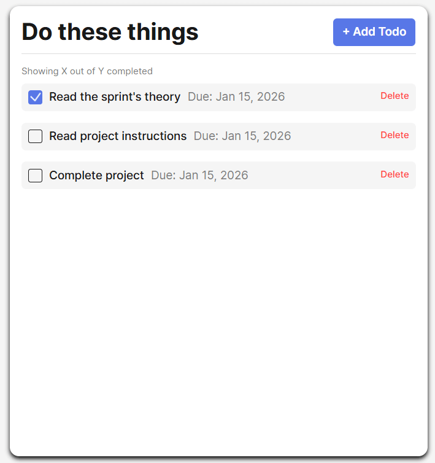
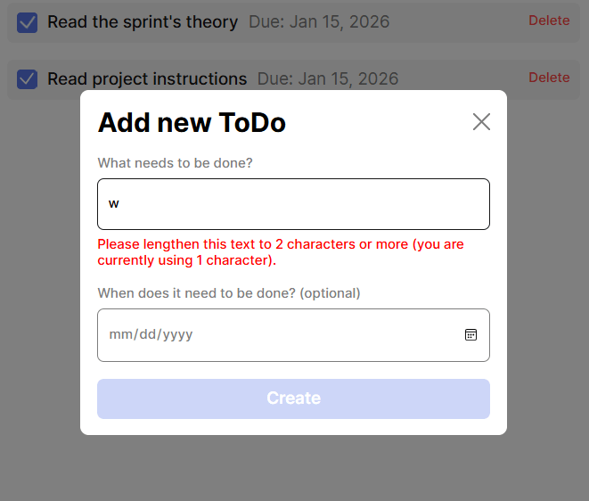

# SE Project Todo App

A simple to-do list application that lets users add and remove tasks.

## Features

- Add new to-do items
- Delete to-do items
- Form validation to prevent empty submissions

## Technologies & Techniques

- HTML
- CSS
- JavaScript (ES6 Modules)
- Object-Oriented Programming (classes)
- DOM manipulation
- Git & GitHub

## Deployment

This project is deployed on GitHub Pages:
https://bigbet-coding.github.io/se_project_todo-app/

## Screenshots

